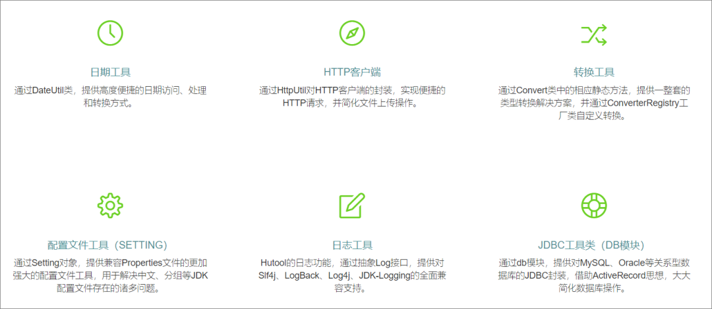

推荐一个非常好用的Java工具类库，企业级常用工具类，基本都有，能避免重复造轮子及节省大量的开发时间，非常不错，值得大家去了解使用。

Hutool 谐音 “糊涂”，寓意追求 “万事都作糊涂观，无所谓失，无所谓得” 的境界。

Hutool 是一个 Java 工具包，也只是一个工具包，它帮助我们简化每一行代码，减少每一个方法，让 Java 语言也可以 “甜甜的”。Hutool 最初是我项目中 “util” 包的一个整理，后来慢慢积累并加入更多非业务相关功能，并广泛学习其它开源项目精髓，经过自己整理修改，最终形成丰富的开源工具集。（抄自作者简介）

官网地址：https://www.hutool.cn/


### 功能

一个 Java 基础工具类，对文件、流、加密解密、转码、正则、线程、XML 等 JDK 方法进行封装，组成各种 Util 工具类，同时提供以下组件：
hutool-aop JDK 动态代理封装，提供非 IOC 下的切面支持
hutool-bloomFilter 布隆过滤，提供一些 Hash 算法的布隆过滤
hutool-cache 缓存
hutool-core 核心，包括 Bean 操作、日期、各种 Util 等
hutool-cron 定时任务模块，提供类 Crontab 表达式的定时任务
hutool-crypto 加密解密模块
hutool-db JDBC 封装后的数据操作，基于 ActiveRecord 思想
hutool-dfa 基于 DFA 模型的多关键字查找
hutool-extra 扩展模块，对第三方封装（模板引擎、邮件等）
hutool-http 基于 HttpUrlConnection 的 Http 客户端封装
hutool-log 自动识别日志实现的日志门面
hutool-script 脚本执行封装，例如 Javascript
hutool-setting 功能更强大的 Setting 配置文件和 Properties 封装
hutool-system 系统参数调用封装（JVM 信息等）
hutool-json JSON 实现
hutool-captcha 图片验证码实现

### 通过Maven引入项目
#### RELEASE版本引用
在项目的pom.xml的dependencies中加入以下内容:
```xml
<dependency>
    <groupId>cn.hutool</groupId>
    <artifactId>hutool-all</artifactId>
    <version>${hutool.version}</version>
</dependency>
```
#### SNAPSHOT版本引用
添加SNAPSHOT支持：
```xml
<parent>
    <groupId>org.sonatype.oss</groupId>
    <artifactId>oss-parent</artifactId>
    <version>9</version>
</parent>
```
引用SNAPSHOT版本的库
```xml
<dependency>
    <groupId>cn.hutool</groupId>
    <artifactId>hutool-all</artifactId>
    <version>${hutool.version}-SNAPSHOT</version>
</dependency>
```
### 通过Gradle引入项目
compile 'cn.hutool:hutool-all:${hutool.version}'
工具包的版本可以通过 http://search.maven.org/ 搜索hutool-all找到项目。

### 简单测试

这两天使用 Hutool 把 Halo 里面的一些代码给替换掉了，不得不说，用起来十分顺心，下面简单介绍一下我用到的一些 Hutool 的工具类。

### SecureUtil（加密解密工具）

主要是在登录的时候还有修改密码的时候用到的，因为数据库里面的密码是 md5 加密处理的，所以登录的时候需要先加密之后再到数据库进行查询，使用 Hutool 的话，只需要调用 SecureUtil 中的 md5 方法就可以了。

user = userService.userLoginByName(loginName,SecureUtil.md5(loginPwd));


### HtmlUtil（HTML 工具类）

这个工具类就比较厉害了，不过我在 Halo 当中用得最多的还是 HtmlUtil.encode，可以将一些字符转化为安全字符，防止 xss 注入和 SQL 注入，比如下面的评论提交。

comment.setCommentAuthor(HtmlUtil.encode(comment.getCommentAuthor()));
这就是防止有小坏蛋故意写一些可执行的 js 代码，然后提交评论，在后台面板就会执行这一段代码，比较危险，使用 encode 方法就可以将 标签给转化成，这样转化之后，js 代码就不会执行了。

另外，HtmlUtil 还提供了以下方法，有兴趣的可以去试一下。

HtmlUtil.restoreEscaped 还原被转义的 HTML 特殊字符
HtmlUtil.encode 转义文本中的 HTML 字符为安全的字符
HtmlUtil.cleanHtmlTag 清除所有 HTML 标签
HtmlUtil.removeHtmlTag 清除指定 HTML 标签和被标签包围的内容
HtmlUtil.unwrapHtmlTag 清除指定 HTML 标签，不包括内容
HtmlUtil.removeHtmlAttr 去除 HTML 标签中的属性
HtmlUtil.removeAllHtmlAttr 去除指定标签的所有属性
HtmlUtil.filter 过滤 HTML 文本，防止 XSS 攻击


### CronUtil（定时任务）


这个工具就更厉害了，完全不需要类似 quartz 这样的框架来做定时任务，而且 CronUtil 也不需要任何其他依赖，只需要在 resources 下建一个配置文件，然后在程序启动的时候将定时任务开启就行了，如 Halo 的定时备份功能（每天凌晨 1 点备份一次）。

cron.setting:

```java
cc.ryanc.halo.web.controller.admin.BackupController.backupResources = 0 0 1 * * ?
cc.ryanc.halo.web.controller.admin.BackupController.backupDatabase = 0 0 1 * * ?
cc.ryanc.halo.web.controller.admin.BackupController.backupPosts = 0 0 1 * * ?
@Override
public void onApplicationEvent(ContextRefreshedEvent event){
 this.loadActiveTheme();
 this.loadOptions();
 this.loadFiles();
 this.loadThemes();
 //启动定时任务
 CronUtil.start();
 log.info("定时任务启动成功！");
}
```
具体使用方法请看文档 ：http://hutool.mydoc.io/?t=255673

好了，就介绍这三个工具类，有兴趣的可以去试试其他的工具，挺全的，这应该是我用过最好用的一个工具类库了，值得一试。

官网地址：http://www.hutool.cn/