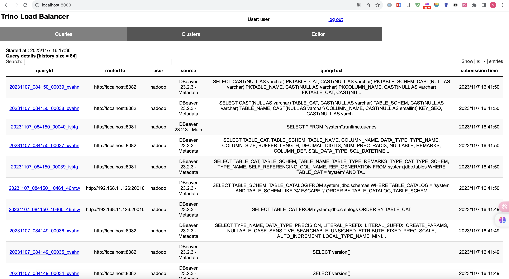
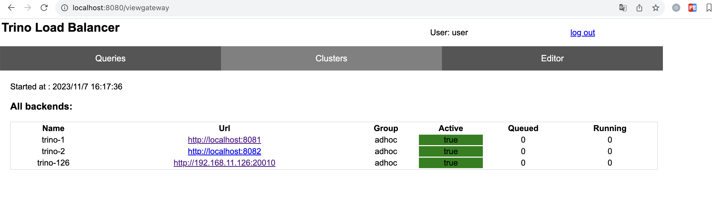
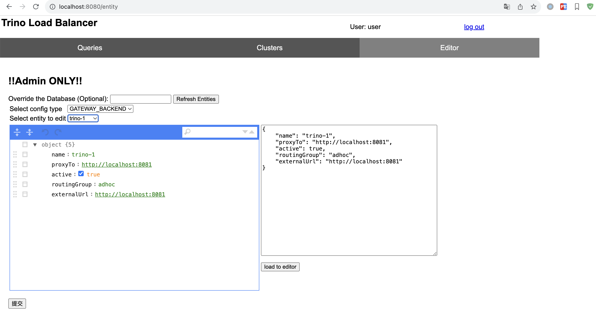
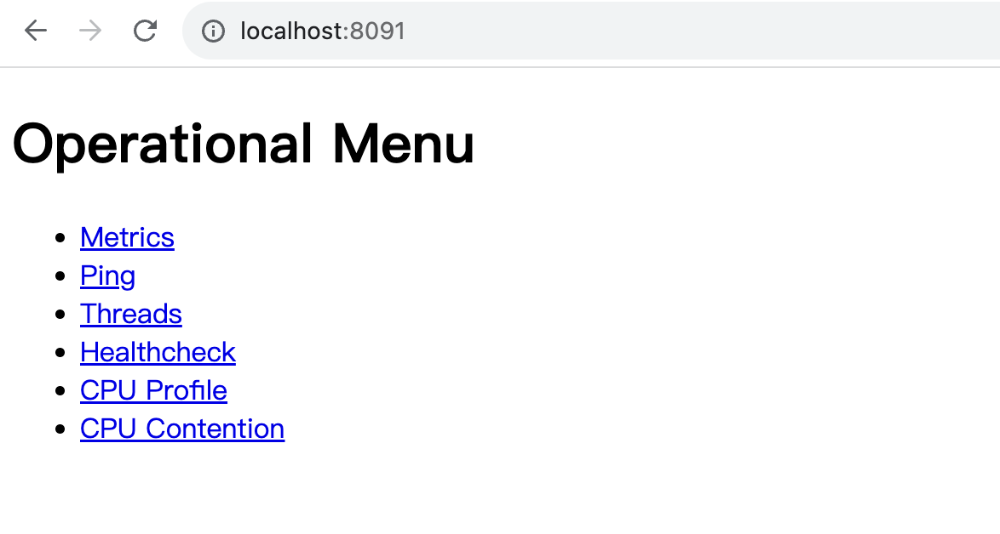
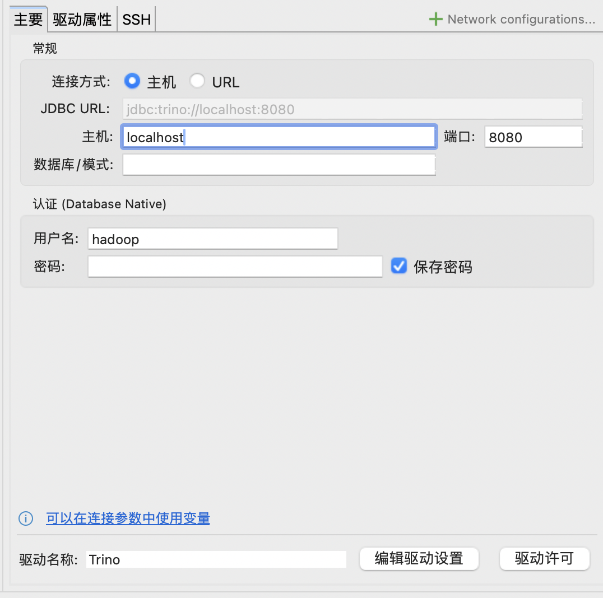
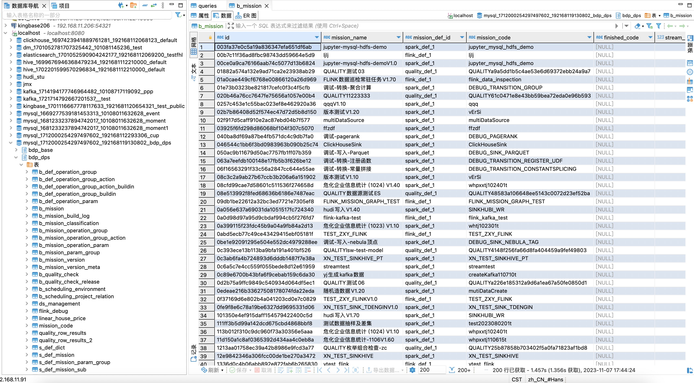

# trino-gateway

## 简介
```
A load balancer, proxy server, and configurable routing gateway for multiple Trino clusters.
```
这是trino-gateway github中的介绍，一个集负载均衡，代理服务与网关路由配置的多trino集群。其实可以简单理解为代理服务，与我们使用vpn类似。

```
ou started with one Trino cluster, and your users like the power for SQL and querying all sorts of data sources. Then you needed to upgrade and got a cluster for testing going. That was a while ago, and now you run a separate cluster configured for ETL workloads with fault-tolerant execution, and some others with different configurations.
您从一个 Trino 集群开始，您的用户喜欢 SQL 和查询各种数据源的强大功能。然后，您需要升级并获取一个用于测试的集群。那是很久以前的事了，现在你运行一个单独的集群，该集群配置为具有容错执行的 ETL 工作负载，以及一些具有不同配置的其他集群。

With Trino Gateway we now have an answer to your users request to provide one URL for all the clusters. Trino Gateway has arrived!
借助 Trino Gateway，我们现在可以回答您的用户请求，为所有集群提供一个 URL。Trino Gateway来了！

Today, we are happy to announce our first release of Trino Gateway. The release is the result of many, many months of effort to move the legacy Presto Gateway to Trino, start a refactor of the project, and add numerous new features.
今天，我们很高兴地宣布我们的第一个 Trino Gateway 版本。该版本是将旧版 Presto 网关迁移到 Trino、开始重构项目并添加许多新功能的数月努力的结果。

Many larger deployments across the Trino community rely on the gateway as a load balancer, proxy server, and configurable routing gateway for multiple Trino clusters. Users don’t need to worry about what catalog and data source is available in what Trino cluster. Trino Gateway exposes one URL for them all. Administrators can ensure routing is correct and use the REST API to configure the necessary rules. This also allows seamless upgrades of clusters behind Trino Gateway in a blue/green deployment mode.
Trino 社区中的许多大型部署都依赖网关作为负载平衡器、代理服务器和多个 Trino 集群的可配置路由网关。用户无需担心哪个 Trino 集群中有哪些目录和数据源可用。Trino Gateway 为它们公开了一个 URL。管理员可以确保路由正确，并使用 REST API 配置必要的规则。这还允许在蓝/绿部署模式下无缝升级 Trino Gateway 后面的集群。
```

trino-gateway项目的最早提交记录是2023年9月5日；trino-gateway项目是由presto-gateway项目迁移过来的，后者最早开始于2018年9月。

## 部署使用

### 本地开发环境构建（已postgres为例）

 - 当前例子已docker部署postgres和trino实例，在这之前先准备docker环境
 -  拉取源代码：
```shell
git clone https://github.com/trinodb/trino-gateway.git
```

 - 进入localdev目录通过docker拉取postgres和两个trino实例
```shell
cd localdev
docker-compose up -d
```

- 检查服务状态
```shell
docker-compose ps
```

- postgres服务正常后，为后端服务创建库表
```shell
docker-compose exec postgres sh -c 'PGPASSWORD="P0stG&es" psql -h localhost -p 5432 -U trino_gateway_db_admin -d trino_gateway_db -f /etc/postgresql/gateway-ha-persistence-postgres.sql'
```

- 添加trino集群信息，会将docker拉起来的两个集群信息写入对应的库表中以供后续gateway使用
```shell
docker-compose exec postgres sh -c 'PGPASSWORD="P0stG&es" psql -h localhost -p 5432 -U trino_gateway_db_admin -d trino_gateway_db -f /etc/postgresql/add_backends_postgres.sql'
```

- 编译trino-gateway
```shell
./mvnw clean install -U -DskipTests
... ...
[INFO] ------------------------------------------------------------------------
[INFO] Reactor Summary for trino-gateway-parent 4-SNAPSHOT:
[INFO] 
[INFO] trino-gateway-parent ............................... SUCCESS [  1.460 s]
[INFO] baseapp ............................................ SUCCESS [  3.159 s]
[INFO] proxyserver ........................................ SUCCESS [  2.405 s]
[INFO] gateway-ha ......................................... SUCCESS [ 15.799 s]
[INFO] ------------------------------------------------------------------------
[INFO] BUILD SUCCESS
[INFO] ------------------------------------------------------------------------
[INFO] Total time:  22.997 s
[INFO] Finished at: 2023-11-07T17:17:28+08:00
[INFO] ------------------------------------------------------------------------
```

- 更新配置文件
```yml
routingRules:
  rulesEngineEnabled: False
  # rulesConfigPath: "src/main/resources/rules/routing_rules.yml"

requestRouter:
  port: 8080
  name: trinoRouter
  historySize: 1000
  requestBufferSize: 8192

dataStore:
  jdbcUrl: jdbc:postgresql://localhost:5432/trino_gateway_db
  user: trino_gateway_db_admin
  password: P0stG&es
  driver: org.postgresql.Driver
  queryHistoryHoursRetention: 24

backendState:
  username: lb_query
  ssl: false

clusterStatsConfiguration:
  useApi: true

server:
  applicationConnectors:
    - type: http
      port: 8090
  adminConnectors:
    - type: http
      port: 8091

# This can be adjusted based on the coordinator state
monitor:
  connectionTimeout: 15

modules:
  - io.trino.gateway.ha.module.HaGatewayProviderModule
  - io.trino.gateway.ha.module.ClusterStateListenerModule
  - io.trino.gateway.ha.module.ClusterStatsMonitorModule

managedApps:
  - io.trino.gateway.ha.GatewayManagedApp
  - io.trino.gateway.ha.clustermonitor.ActiveClusterMonitor

# Logging settings.
logging:
  # The default level of all loggers. Can be OFF, ERROR, WARN, INFO, DEBUG, TRACE, or ALL.
  level: INFO

  # Logger-specific levels.
  loggers:
    io.trino: DEBUG

  appenders:
    - type: console
#      filterFactories:
#        - type: Log-filter-factory
```

- 本地运行trino-gateway
```shell
cd gateway-ha/target/
java --add-opens=java.base/java.lang=ALL-UNNAMED --add-opens=java.base/java.net=ALL-UNNAMED -jar gateway-ha-4-SNAPSHOT-jar-with-dependencies.jar server ../gateway-ha-config.yml
```

# 环境试验

## 本地trino集群部署

本地postgres，两个trino实例已经创建库表并增加两个trino实例的数据过程参照前置描述，此处略过

## trino-gateway构建部署

```shell
java --add-opens=java.base/java.lang=ALL-UNNAMED --add-opens=java.base/java.net=ALL-UNNAMED -jar gateway-ha-4-SNAPSHOT-jar-with-dependencies.jar server ../gateway-ha-config.yml

INFO  [2023-11-07 08:17:36,241] io.dropwizard.core.server.DefaultServerFactory: Registering jersey handler with root path prefix: /
INFO  [2023-11-07 08:17:36,242] io.dropwizard.core.server.DefaultServerFactory: Registering admin handler with root path prefix: /
INFO  [2023-11-07 08:17:36,243] io.dropwizard.assets.AssetsBundle: Registering AssetBundle with name: assets for path /assets/*
INFO  [2023-11-07 08:17:36,244] io.trino.gateway.baseapp.BaseApp: Trying to load module [io.trino.gateway.ha.module.HaGatewayProviderModule]
INFO  [2023-11-07 08:17:36,257] io.trino.gateway.baseapp.BaseApp: Trying to load module [io.trino.gateway.ha.module.ClusterStateListenerModule]
INFO  [2023-11-07 08:17:36,257] io.trino.gateway.baseapp.BaseApp: Trying to load module [io.trino.gateway.ha.module.ClusterStatsMonitorModule]
INFO  [2023-11-07 08:17:36,320] io.trino.gateway.baseapp.BaseApp: op=register_start configuration=HaGatewayConfiguration(requestRouter=RequestRouterConfiguration(port=8080, name=trinoRouter, ssl=false, keystorePath=null, keystorePass=null, historySize=1000, forwardKeystore=false, outputBufferSize=32768, requestHeaderSize=8192, responseHeaderSize=8192, requestBufferSize=8192, responseBufferSize=16384), notifier=null, dataStore=DataStoreConfiguration(jdbcUrl=jdbc:postgresql://localhost:5432/trino_gateway_db, user=trino_gateway_db_admin, password=P0stG&es, driver=org.postgresql.Driver, queryHistoryHoursRetention=24), monitor=MonitorConfiguration(connectionTimeout=15, taskDelayMin=1), routingRules=RoutingRulesConfiguration(rulesEngineEnabled=false, rulesConfigPath=null), authentication=null, authorization=null, presetUsers={}, backendState=BackendStateConfiguration(username=lb_query, password=, ssl=false), clusterStatsConfiguration=ClusterStatsConfiguration(useApi=true), extraWhitelistPaths=[])
INFO  [2023-11-07 08:17:36,320] io.trino.gateway.baseapp.BaseApp: op=register type=auth filter item=class io.dropwizard.auth.AuthFilter
INFO  [2023-11-07 08:17:36,342] io.trino.gateway.baseapp.BaseApp: op=register type=managed item=class io.trino.gateway.ha.GatewayManagedApp
INFO  [2023-11-07 08:17:36,344] io.trino.gateway.ha.clustermonitor.ActiveClusterMonitor: Running cluster monitor with connection timeout of 15 and task delay of 1
INFO  [2023-11-07 08:17:36,344] io.trino.gateway.baseapp.BaseApp: op=register type=managed item=class io.trino.gateway.ha.clustermonitor.ActiveClusterMonitor
INFO  [2023-11-07 08:17:36,361] io.trino.gateway.baseapp.BaseApp: op=register type=resource item=class io.trino.gateway.ha.resource.GatewayViewResource
INFO  [2023-11-07 08:17:36,362] io.trino.gateway.baseapp.BaseApp: op=register type=resource item=class io.trino.gateway.ha.resource.EntityEditorResource
INFO  [2023-11-07 08:17:36,364] io.trino.gateway.baseapp.BaseApp: op=register type=resource item=class io.trino.gateway.ha.resource.GatewayResource
INFO  [2023-11-07 08:17:36,365] io.trino.gateway.baseapp.BaseApp: op=register type=resource item=class io.trino.gateway.ha.resource.LoginResource
INFO  [2023-11-07 08:17:36,366] io.trino.gateway.baseapp.BaseApp: op=register type=resource item=class io.trino.gateway.ha.resource.TrinoResource
INFO  [2023-11-07 08:17:36,367] io.trino.gateway.baseapp.BaseApp: op=register type=resource item=class io.trino.gateway.ha.resource.PublicResource
INFO  [2023-11-07 08:17:36,368] io.trino.gateway.baseapp.BaseApp: op=register type=resource item=class io.trino.gateway.ha.resource.HaGatewayResource
INFO  [2023-11-07 08:17:36,368] io.trino.gateway.baseapp.BaseApp: op=register_end configuration=HaGatewayConfiguration(requestRouter=RequestRouterConfiguration(port=8080, name=trinoRouter, ssl=false, keystorePath=null, keystorePass=null, historySize=1000, forwardKeystore=false, outputBufferSize=32768, requestHeaderSize=8192, responseHeaderSize=8192, requestBufferSize=8192, responseBufferSize=16384), notifier=null, dataStore=DataStoreConfiguration(jdbcUrl=jdbc:postgresql://localhost:5432/trino_gateway_db, user=trino_gateway_db_admin, password=P0stG&es, driver=org.postgresql.Driver, queryHistoryHoursRetention=24), monitor=MonitorConfiguration(connectionTimeout=15, taskDelayMin=1), routingRules=RoutingRulesConfiguration(rulesEngineEnabled=false, rulesConfigPath=null), authentication=null, authorization=null, presetUsers={}, backendState=BackendStateConfiguration(username=lb_query, password=, ssl=false), clusterStatsConfiguration=ClusterStatsConfiguration(useApi=true), extraWhitelistPaths=[])
INFO  [2023-11-07 08:17:36,368] io.trino.gateway.baseapp.BaseApp: op=configure_guice injector=Injector{bindings=[InstanceBinding{key=Key[type=com.google.inject.Stage, annotation=[none]], source=[unknown source], instance=DEVELOPMENT}, ProviderInstanceBinding{key=Key[type=com.google.inject.Injector, annotation=[none]], source=[unknown source], scope=Scopes.NO_SCOPE, provider=Provider<Injector>}, ProviderInstanceBinding{key=Key[type=java.util.logging.Logger, annotation=[none]], source=[unknown source], scope=Scopes.NO_SCOPE, provider=Provider<Logger>}, InstanceBinding{key=Key[type=com.codahale.metrics.MetricRegistry, annotation=[none]], source=io.trino.gateway.baseapp.MetricRegistryModule.configure(MetricRegistryModule.java:19), instance=com.codahale.metrics.MetricRegistry@185339ed}, ProviderInstanceBinding{key=Key[type=io.dropwizard.auth.AuthFilter, annotation=[none]], source=public io.dropwizard.auth.AuthFilter io.trino.gateway.ha.module.HaGatewayProviderModule.getAuthenticationFilter(), scope=Scopes.SINGLETON, provider=@Provides io.trino.gateway.ha.module.HaGatewayProviderModule.getAuthenticationFilter(HaGatewayProviderModule.java:263)}, ProviderInstanceBinding{key=Key[type=io.trino.gateway.ha.security.LbOAuthManager, annotation=[none]], source=public io.trino.gateway.ha.security.LbOAuthManager io.trino.gateway.ha.module.HaGatewayProviderModule.getAuthenticationManager(), scope=Scopes.SINGLETON, provider=@Provides io.trino.gateway.ha.module.HaGatewayProviderModule.getAuthenticationManager(HaGatewayProviderModule.java:245)}, ProviderInstanceBinding{key=Key[type=io.trino.gateway.ha.security.AuthorizationManager, annotation=[none]], source=public io.trino.gateway.ha.security.AuthorizationManager io.trino.gateway.ha.module.HaGatewayProviderModule.getAuthorizationManager(), scope=Scopes.SINGLETON, provider=@Provides io.trino.gateway.ha.module.HaGatewayProviderModule.getAuthorizationManager(HaGatewayProviderModule.java:257)}, ProviderInstanceBinding{key=Key[type=io.trino.gateway.ha.router.BackendStateManager, annotation=[none]], source=public io.trino.gateway.ha.router.BackendStateManager io.trino.gateway.ha.module.HaGatewayProviderModule.getBackendStateConnectionManager(), scope=Scopes.SINGLETON, provider=@Provides io.trino.gateway.ha.module.HaGatewayProviderModule.getBackendStateConnectionManager(HaGatewayProviderModule.java:269)}, ProviderInstanceBinding{key=Key[type=io.trino.gateway.ha.persistence.JdbcConnectionManager, annotation=[none]], source=public io.trino.gateway.ha.persistence.JdbcConnectionManager io.trino.gateway.ha.module.HaGatewayProviderModule.getConnectionManager(), scope=Scopes.SINGLETON, provider=@Provides io.trino.gateway.ha.module.HaGatewayProviderModule.getConnectionManager(HaGatewayProviderModule.java:239)}, ProviderInstanceBinding{key=Key[type=io.trino.gateway.ha.security.LbFormAuthManager, annotation=[none]], source=public io.trino.gateway.ha.security.LbFormAuthManager io.trino.gateway.ha.module.HaGatewayProviderModule.getFormAuthentication(), scope=Scopes.SINGLETON, provider=@Provides io.trino.gateway.ha.module.HaGatewayProviderModule.getFormAuthentication(HaGatewayProviderModule.java:251)}, ProviderInstanceBinding{key=Key[type=io.trino.gateway.ha.router.GatewayBackendManager, annotation=[none]], source=public io.trino.gateway.ha.router.GatewayBackendManager io.trino.gateway.ha.module.HaGatewayProviderModule.getGatewayBackendManager(), scope=Scopes.SINGLETON, provider=@Provides io.trino.gateway.ha.module.HaGatewayProviderModule.getGatewayBackendManager(HaGatewayProviderModule.java:221)}, ProviderInstanceBinding{key=Key[type=io.trino.gateway.ha.router.QueryHistoryManager, annotation=[none]], source=public io.trino.gateway.ha.router.QueryHistoryManager io.trino.gateway.ha.module.HaGatewayProviderModule.getQueryHistoryManager(), scope=Scopes.SINGLETON, provider=@Provides io.trino.gateway.ha.module.HaGatewayProviderModule.getQueryHistoryManager(HaGatewayProviderModule.java:227)}, ProviderInstanceBinding{key=Key[type=io.trino.gateway.ha.router.ResourceGroupsManager, annotation=[none]], source=public io.trino.gateway.ha.router.ResourceGroupsManager io.trino.gateway.ha.module.HaGatewayProviderModule.getResourceGroupsManager(), scope=Scopes.SINGLETON, provider=@Provides io.trino.gateway.ha.module.HaGatewayProviderModule.getResourceGroupsManager(HaGatewayProviderModule.java:215)}, ProviderInstanceBinding{key=Key[type=io.trino.gateway.ha.router.RoutingManager, annotation=[none]], source=public io.trino.gateway.ha.router.RoutingManager io.trino.gateway.ha.module.HaGatewayProviderModule.getRoutingManager(), scope=Scopes.SINGLETON, provider=@Provides io.trino.gateway.ha.module.HaGatewayProviderModule.getRoutingManager(HaGatewayProviderModule.java:233)}, ProviderInstanceBinding{key=Key[type=io.trino.gateway.proxyserver.ProxyServer, annotation=[none]], source=public io.trino.gateway.proxyserver.ProxyServer io.trino.gateway.ha.module.HaGatewayProviderModule.provideGateway(), scope=Scopes.SINGLETON, provider=@Provides io.trino.gateway.ha.module.HaGatewayProviderModule.provideGateway(HaGatewayProviderModule.java:187)}, ProviderInstanceBinding{key=Key[type=java.util.List<io.trino.gateway.ha.clustermonitor.TrinoClusterStatsObserver>, annotation=[none]], source=public java.util.List io.trino.gateway.ha.module.ClusterStateListenerModule.getClusterStatsObservers(io.trino.gateway.ha.router.RoutingManager,io.trino.gateway.ha.router.BackendStateManager), scope=Scopes.SINGLETON, provider=@Provides io.trino.gateway.ha.module.ClusterStateListenerModule.getClusterStatsObservers(ClusterStateListenerModule.java:40)}, ProviderInstanceBinding{key=Key[type=io.trino.gateway.ha.config.MonitorConfiguration, annotation=[none]], source=public io.trino.gateway.ha.config.MonitorConfiguration io.trino.gateway.ha.module.ClusterStateListenerModule.getMonitorConfiguration(), scope=Scopes.NO_SCOPE, provider=@Provides io.trino.gateway.ha.module.ClusterStateListenerModule.getMonitorConfiguration(ClusterStateListenerModule.java:50)}, ProviderInstanceBinding{key=Key[type=io.trino.gateway.ha.clustermonitor.ClusterStatsMonitor, annotation=[none]], source=public io.trino.gateway.ha.clustermonitor.ClusterStatsMonitor io.trino.gateway.ha.module.ClusterStatsMonitorModule.getClusterStatsMonitor(), scope=Scopes.SINGLETON, provider=@Provides io.trino.gateway.ha.module.ClusterStatsMonitorModule.getClusterStatsMonitor(ClusterStatsMonitorModule.java:25)}]}
INFO  [2023-11-07 08:17:36,371] io.trino.gateway.baseapp.BaseApp: op=configure_app_custom completed
INFO  [2023-11-07 08:17:36,371] io.dropwizard.core.server.ServerFactory: Starting HaGatewayLauncher
INFO  [2023-11-07 08:17:36,398] org.eclipse.jetty.setuid.SetUIDListener: Opened application@1b485c8b{HTTP/1.1, (http/1.1)}{0.0.0.0:8090}
INFO  [2023-11-07 08:17:36,399] org.eclipse.jetty.setuid.SetUIDListener: Opened admin@59b98ad1{HTTP/1.1, (http/1.1)}{0.0.0.0:8091}
INFO  [2023-11-07 08:17:36,400] org.eclipse.jetty.server.Server: jetty-11.0.15; built: 2023-04-11T18:37:53.775Z; git: 5bc5e562c8d05c5862505aebe5cf83a61bdbcb96; jvm 17.0.8+7-LTS
INFO  [2023-11-07 08:17:36,403] org.eclipse.jetty.server.Server: jetty-11.0.15; built: 2023-04-11T18:37:53.775Z; git: 5bc5e562c8d05c5862505aebe5cf83a61bdbcb96; jvm 17.0.8+7-LTS
INFO  [2023-11-07 08:17:36,405] org.eclipse.jetty.server.session.DefaultSessionIdManager: Session workerName=node0
WARN  [2023-11-07 08:17:36,682] org.eclipse.jetty.util.ssl.SslContextFactory.config: Trusting all certificates configured for Client@19e2db7c[provider=null,keyStore=null,trustStore=null]
WARN  [2023-11-07 08:17:36,682] org.eclipse.jetty.util.ssl.SslContextFactory.config: No Client EndPointIdentificationAlgorithm configured for Client@19e2db7c[provider=null,keyStore=null,trustStore=null]
DEBUG [2023-11-07 08:17:36,687] io.trino.gateway.proxyserver.ProxyServletImpl.trinoRouter: trinoRouter @ / to 
INFO  [2023-11-07 08:17:36,687] org.eclipse.jetty.server.handler.ContextHandler: Started o.e.j.s.ServletContextHandler@55e5415d{/,null,AVAILABLE}
INFO  [2023-11-07 08:17:36,688] org.eclipse.jetty.server.AbstractConnector: Started trinoRouter@61b8c9de{HTTP/1.1, (http/1.1)}{0.0.0.0:8080}
INFO  [2023-11-07 08:17:36,693] org.eclipse.jetty.server.Server: Started Server@1b8ee69d{STARTING}[11.0.15,sto=0] @1188ms
DEBUG [2023-11-07 08:17:36,693] io.trino.gateway.ha.persistence.JdbcConnectionManager: Jdbc url is jdbc:postgresql://localhost:5432/trino_gateway_db

DEBUG [2023-11-07 08:17:36,802] io.trino.gateway.ha.persistence.JdbcConnectionManager: Connection opened
INFO  [2023-11-07 08:17:36,806] org.javalite.activejdbc.Configuration: Reading properties from: /database.properties. Will try classpath, then file system.
INFO  [2023-11-07 08:17:36,871] io.dropwizard.jersey.DropwizardResourceConfig: The following paths were found for the configured resources:

    GET     / (io.trino.gateway.ha.resource.GatewayViewResource)
    GET     /api/activeBackends (io.trino.gateway.ha.resource.GatewayViewResource)
    GET     /api/public/backends (io.trino.gateway.ha.resource.PublicResource)
    GET     /api/public/backends/{name} (io.trino.gateway.ha.resource.PublicResource)
    GET     /api/public/backends/{name}/state (io.trino.gateway.ha.resource.PublicResource)
    GET     /api/queryHistory (io.trino.gateway.ha.resource.GatewayViewResource)
    GET     /api/queryHistoryDistribution (io.trino.gateway.ha.resource.GatewayViewResource)
    GET     /entity (io.trino.gateway.ha.resource.EntityEditorResource)
    POST    /entity (io.trino.gateway.ha.resource.EntityEditorResource)
    GET     /entity/{entityType} (io.trino.gateway.ha.resource.EntityEditorResource)
    GET     /gateway (io.trino.gateway.ha.resource.GatewayResource)
    POST    /gateway/backend/activate/{name} (io.trino.gateway.ha.resource.GatewayResource)
    GET     /gateway/backend/active (io.trino.gateway.ha.resource.GatewayResource)
    GET     /gateway/backend/all (io.trino.gateway.ha.resource.GatewayResource)
    POST    /gateway/backend/deactivate/{name} (io.trino.gateway.ha.resource.GatewayResource)
    POST    /gateway/backend/modify/add (io.trino.gateway.ha.resource.HaGatewayResource)
    POST    /gateway/backend/modify/delete (io.trino.gateway.ha.resource.HaGatewayResource)
    POST    /gateway/backend/modify/update (io.trino.gateway.ha.resource.HaGatewayResource)
    GET     /login (io.trino.gateway.ha.resource.LoginResource)
    POST    /login_form (io.trino.gateway.ha.resource.LoginResource)
    GET     /logout (io.trino.gateway.ha.resource.LoginResource)
    GET     /oidc/callback (io.trino.gateway.ha.resource.LoginResource)
    GET     /sso (io.trino.gateway.ha.resource.LoginResource)
    POST    /trino/globalproperty/create (io.trino.gateway.ha.resource.TrinoResource)
    POST    /trino/globalproperty/delete/{name} (io.trino.gateway.ha.resource.TrinoResource)
    GET     /trino/globalproperty/read (io.trino.gateway.ha.resource.TrinoResource)
    GET     /trino/globalproperty/read/{name} (io.trino.gateway.ha.resource.TrinoResource)
    POST    /trino/globalproperty/update (io.trino.gateway.ha.resource.TrinoResource)
    POST    /trino/resourcegroup/create (io.trino.gateway.ha.resource.TrinoResource)
    POST    /trino/resourcegroup/delete/{resourceGroupId} (io.trino.gateway.ha.resource.TrinoResource)
    GET     /trino/resourcegroup/read (io.trino.gateway.ha.resource.TrinoResource)
    GET     /trino/resourcegroup/read/{resourceGroupId} (io.trino.gateway.ha.resource.TrinoResource)
    POST    /trino/resourcegroup/update (io.trino.gateway.ha.resource.TrinoResource)
    POST    /trino/selector/create (io.trino.gateway.ha.resource.TrinoResource)
    POST    /trino/selector/delete (io.trino.gateway.ha.resource.TrinoResource)
    GET     /trino/selector/read (io.trino.gateway.ha.resource.TrinoResource)
    GET     /trino/selector/read/{resourceGroupId} (io.trino.gateway.ha.resource.TrinoResource)
    POST    /trino/selector/update (io.trino.gateway.ha.resource.TrinoResource)
    GET     /viewgateway (io.trino.gateway.ha.resource.GatewayViewResource)

INFO  [2023-11-07 08:17:36,871] org.eclipse.jetty.server.handler.ContextHandler: Started i.d.j.MutableServletContextHandler@4cbb11e4{/,null,AVAILABLE}
INFO  [2023-11-07 08:17:36,873] io.dropwizard.core.setup.AdminEnvironment: tasks = 

    POST    /tasks/log-level (io.dropwizard.servlets.tasks.LogConfigurationTask)
    POST    /tasks/gc (io.dropwizard.servlets.tasks.GarbageCollectionTask)

WARN  [2023-11-07 08:17:36,873] io.dropwizard.core.setup.AdminEnvironment: 
!!!!!!!!!!!!!!!!!!!!!!!!!!!!!!!!!!!!!!!!!!!!!!!!!!!!!!!!!!!!!!!!!!!!!!!!!!!!!!!!
!!!!!!!!!!!!!!!!!!!!!!!!!!!!!!!!!!!!!!!!!!!!!!!!!!!!!!!!!!!!!!!!!!!!!!!!!!!!!!!!
!    THIS APPLICATION HAS NO HEALTHCHECKS. THIS MEANS YOU WILL NEVER KNOW      !
!     IF IT DIES IN PRODUCTION, WHICH MEANS YOU WILL NEVER KNOW IF YOU'RE      !
!    LETTING YOUR USERS DOWN. YOU SHOULD ADD A HEALTHCHECK FOR EACH OF YOUR    !
!         APPLICATION'S DEPENDENCIES WHICH FULLY (BUT LIGHTLY) TESTS IT.       !
!!!!!!!!!!!!!!!!!!!!!!!!!!!!!!!!!!!!!!!!!!!!!!!!!!!!!!!!!!!!!!!!!!!!!!!!!!!!!!!!
!!!!!!!!!!!!!!!!!!!!!!!!!!!!!!!!!!!!!!!!!!!!!!!!!!!!!!!!!!!!!!!!!!!!!!!!!!!!!!!!
INFO  [2023-11-07 08:17:36,873] org.eclipse.jetty.server.handler.ContextHandler: Started i.d.j.MutableServletContextHandler@48188d23{/,null,AVAILABLE}
INFO  [2023-11-07 08:17:36,874] org.eclipse.jetty.server.AbstractConnector: Started application@1b485c8b{HTTP/1.1, (http/1.1)}{0.0.0.0:8090}
INFO  [2023-11-07 08:17:36,874] org.eclipse.jetty.server.AbstractConnector: Started admin@59b98ad1{HTTP/1.1, (http/1.1)}{0.0.0.0:8091}
INFO  [2023-11-07 08:17:36,874] org.eclipse.jetty.server.Server: Started Server@3b347439{STARTING}[11.0.15,sto=30000] @1370ms
INFO  [2023-11-07 08:17:37,008] org.ehcache.core.EhcacheManager: Cache 'gateway_backend' created in EhcacheManager.
DEBUG [2023-11-07 08:17:37,015] io.trino.gateway.ha.persistence.JdbcConnectionManager: Connection closed
INFO  [2023-11-07 08:17:37,063] io.trino.gateway.ha.clustermonitor.ClusterStatsHttpMonitor: login request received response code 200
INFO  [2023-11-07 08:17:37,065] io.trino.gateway.ha.clustermonitor.ClusterStatsHttpMonitor: login request received response code 200
INFO  [2023-11-07 08:17:37,072] io.trino.gateway.ha.clustermonitor.ClusterStatsHttpMonitor: login request received response code 200
INFO  [2023-11-07 08:17:37,074] io.trino.gateway.ha.clustermonitor.ClusterStatsHttpMonitor: login request received response code 200
INFO  [2023-11-07 08:17:37,089] io.trino.gateway.ha.router.RoutingManager: backend trino-1 isHealthy true
DEBUG [2023-11-07 08:17:37,089] io.trino.gateway.ha.persistence.JdbcConnectionManager: Jdbc url is jdbc:postgresql://localhost:5432/trino_gateway_db
DEBUG [2023-11-07 08:17:37,108] io.trino.gateway.ha.persistence.JdbcConnectionManager: Connection opened
DEBUG [2023-11-07 08:17:37,110] io.trino.gateway.ha.persistence.JdbcConnectionManager: Connection closed
INFO  [2023-11-07 08:17:37,110] io.trino.gateway.ha.router.RoutingManager: backend trino-2 isHealthy true
DEBUG [2023-11-07 08:17:37,110] io.trino.gateway.ha.persistence.JdbcConnectionManager: Jdbc url is jdbc:postgresql://localhost:5432/trino_gateway_db
DEBUG [2023-11-07 08:17:37,120] io.trino.gateway.ha.persistence.JdbcConnectionManager: Connection opened
DEBUG [2023-11-07 08:17:37,121] io.trino.gateway.ha.persistence.JdbcConnectionManager: Connection closed
```

## 相关介绍

### 端口情况
- 8080: 可以通过界面访问，且都是trino load banlancer的页面；在load banlancer可以查看查询任务，进查看集群信息并可通过链接跳转至trino集群管理页面，trino-gateway网关管理
- 8090: 同上
- 8091: 指标监控管理页，可以通过点击对应的指标项来监测指标并下载监测数据

## 连接使用

### 查看查询任务


### 查看集群列表


### 网关管理


### 监控指标页


### DBeaver连接使用
连接配置，与直接连接单个trino集群一样





