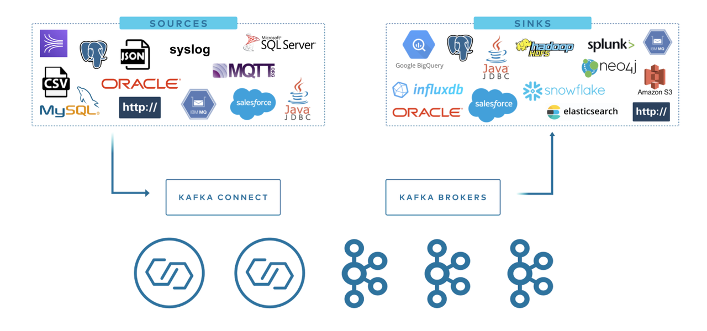
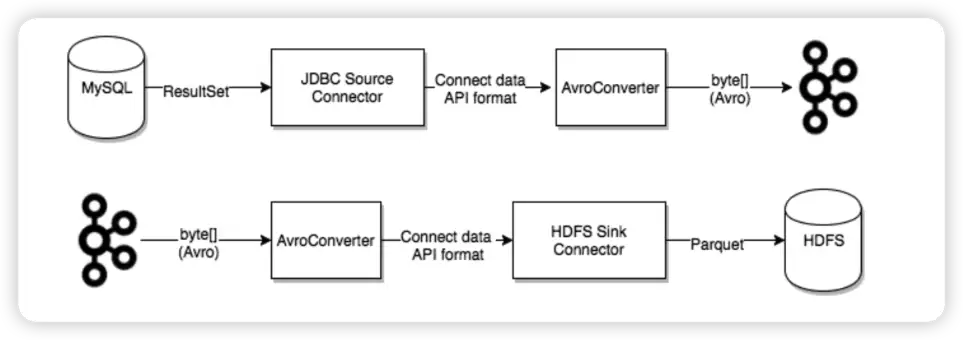

# Kafka Connect 介绍

Kafka Connect 是一个用于在 Apache Kafka® 和其他数据系统之间可扩展且可靠地流式传输数据的工具。通过将数据移入和移出 Kafka 进行标准化，使得快速定义连接器以在 Kafka 中传输大型数据集变得简单，可以更轻松地构建大规模的实时数据管道。



`Kafka 连接器通常用来构建 data pipeline，一般有两种使用场景`：

开始和结束的端点： 例如，将 Kafka 中的数据导出到数据库，或者把 Mysql 数据库中的数据导入 Kafka 中。
数据传输的中间媒介： 例如，为了把海量的日志数据存储到 Elasticsearch 中，可以先把这些日志数据传输到 Kafka 中，然后再从 Kafka 中将这些数据导入到 Elasticsearch 中进行存储。Kafka 连接器可以作为数据管道各个阶段的缓冲区，将消费者程序和生产者程序有效地进行解耦。

`Kafka Connect 分为两种`：

Source Connect： 负责将数据导入 Kafka。
Sink Connect： 负责将数据从 Kafka 系统中导出到目标表。



# Kafka Connect 使用

Kafka Connect 目前支持两种执行模式：Standalone 模式和分布式模式。

### standalong模式

第一个参数 config/connect-standalone.properties 是 worker 的配置。这其中包括 Kafka 连接参数、序列化格式以及提交 Offset 的频率等配置：

```shell
# Licensed to the Apache Software Foundation (ASF) under one or more
# contributor license agreements.  See the NOTICE file distributed with
# this work for additional information regarding copyright ownership.
# The ASF licenses this file to You under the Apache License, Version 2.0
# (the "License"); you may not use this file except in compliance with
# the License.  You may obtain a copy of the License at
#
#    http://www.apache.org/licenses/LICENSE-2.0
#
# Unless required by applicable law or agreed to in writing, software
# distributed under the License is distributed on an "AS IS" BASIS,
# WITHOUT WARRANTIES OR CONDITIONS OF ANY KIND, either express or implied.
# See the License for the specific language governing permissions and
# limitations under the License.

# These are defaults. This file just demonstrates how to override some settings.
bootstrap.servers=localhost:9092

# The converters specify the format of data in Kafka and how to translate it into Connect data. Every Connect user will
# need to configure these based on the format they want their data in when loaded from or stored into Kafka
key.converter=org.apache.kafka.connect.json.JsonConverter
value.converter=org.apache.kafka.connect.json.JsonConverter
# Converter-specific settings can be passed in by prefixing the Converter's setting with the converter we want to apply
# it to
key.converter.schemas.enable=true
value.converter.schemas.enable=true

offset.storage.file.filename=/tmp/connect.offsets
# Flush much faster than normal, which is useful for testing/debugging
offset.flush.interval.ms=10000

# Set to a list of filesystem paths separated by commas (,) to enable class loading isolation for plugins
# (connectors, converters, transformations). The list should consist of top level directories that include 
# any combination of: 
# a) directories immediately containing jars with plugins and their dependencies
# b) uber-jars with plugins and their dependencies
# c) directories immediately containing the package directory structure of classes of plugins and their dependencies
# Note: symlinks will be followed to discover dependencies or plugins.
# Examples: 
# plugin.path=/usr/local/share/java,/usr/local/share/kafka/plugins,/opt/connectors,
#plugin.path=
```

后面的配置是指定要启动的 Connector 的参数。这里配置了mysql source和mysql sink connector：

`mysql source`
```shell
#
# Copyright 2018 Confluent Inc.
#
# Licensed under the Confluent Community License (the "License"); you may not use
# this file except in compliance with the License.  You may obtain a copy of the
# License at
#
# http://www.confluent.io/confluent-community-license
#
# Unless required by applicable law or agreed to in writing, software
# distributed under the License is distributed on an "AS IS" BASIS, WITHOUT
# WARRANTIES OF ANY KIND, either express or implied.  See the License for the
# specific language governing permissions and limitations under the License.
#

# A simple example that copies all tables from a SQLite database. The first few settings are
# required for all connectors: a name, the connector class to run, and the maximum number of
# tasks to create:
name=test-source-mysql-jdbc-autoincrement
connector.class=io.confluent.connect.jdbc.JdbcSourceConnector
tasks.max=1
# The remaining configs are specific to the JDBC source connector. In this example, we connect to a
# SQLite database stored in the file test.db, use and auto-incrementing column called 'id' to
# detect new rows as they are added, and output to topics prefixed with 'test-sqlite-jdbc-', e.g.
# a table called 'users' will be written to the topic 'test-sqlite-jdbc-users'.
connection.url=jdbc:mysql://192.168.11.91:30802/biz_monitor_warn
connection.user=root
connection.password=root
table.whitelist=t_alert,t_threshold_alarm
topic.prefix=connect-jdbc-monitor_warn_

mode=timestamp
timestamp.column.name=submissionTime

# Define when identifiers should be quoted in DDL and DML statements.
# The default is 'always' to maintain backward compatibility with prior versions.
# Set this to 'never' to avoid quoting fully-qualified or simple table and column names.
#quote.sql.identifiers=always
```


`mysql sink`
```shell
#
# Copyright 2018 Confluent Inc.
#
# Licensed under the Confluent Community License (the "License"); you may not use
# this file except in compliance with the License.  You may obtain a copy of the
# License at
#
# http://www.confluent.io/confluent-community-license
#
# Unless required by applicable law or agreed to in writing, software
# distributed under the License is distributed on an "AS IS" BASIS, WITHOUT
# WARRANTIES OF ANY KIND, either express or implied.  See the License for the
# specific language governing permissions and limitations under the License.
#

# A simple example that copies from a topic to a SQLite database.
# The first few settings are required for all connectors:
# a name, the connector class to run, and the maximum number of tasks to create:
name=test-sink
connector.class=io.confluent.connect.jdbc.JdbcSinkConnector
tasks.max=1

# The topics to consume from - required for sink connectors like this one
topics=connect-jdbc-monitor_warn_t_alert,connect-jdbc-monitor_warn_t_threshold_alarm

# Configuration specific to the JDBC sink connector.
# We want to connect to a SQLite database stored in the file test.db and auto-create tables.
connection.url=jdbc:mysql://192.168.11.91:30802/zm_test_2404
connection.user=root
connection.password=root
auto.create=true

# Define when identifiers should be quoted in DDL and DML statements.
# The default is 'always' to maintain backward compatibility with prior versions.
# Set this to 'never' to avoid quoting fully-qualified or simple table and column names.
#quote.sql.identifiers=always
```


`启动命令：`
```shell
./connect-standalone.sh ../config/connect-standalone.properties ../config/connect-jdbc-source-mysql.properties ../config/connect-jdbc-sink-mysql.properties
```

### distributed 模式

分布式模式可以自动平衡工作负载，并可以动态扩展（或缩减）以及提供容错。分布式模式的执行与 Standalone 模式非常相似：

```shell
bin/connect-distributed.sh config/connect-distributed.properties
```

不同之处在于启动的脚本以及配置参数。在分布式模式下，使用 `connect-distributed.sh` 来代替 `connect-standalone.sh`。第一个 worker 配置参数使用的是 `config/connect-distributed.properties` 配置文件：

```shell
bootstrap.servers=localhost:9092
group.id=connect-cluster
key.converter.schemas.enable=true
value.converter.schemas.enable=true
offset.storage.topic=connect-offsets
offset.storage.replication.factor=1
#offset.storage.partitions=25
config.storage.topic=connect-configs
config.storage.replication.factor=1
status.storage.topic=connect-status
status.storage.replication.factor=1
#status.storage.partitions=5
offset.flush.interval.ms=10000
```

Kafka Connect 将 Offset、配置以及任务状态存储在 Kafka Topic 中。建议手动创建 Offset、配置和状态的 Topic，以达到所需的分区数和复制因子。如果在启动 Kafka Connect 时尚未创建 Topic，将使用默认分区数和复制因子来自动创建 Topic，这可能不适合我们的应用。在启动集群之前配置如下参数至关重要：

`group.id`： Connect 集群的唯一名称，默认为 connect-cluster。具有相同 group id 的 worker 属于同一个 Connect 集群。需要注意的是这不能与消费者组 ID 冲突。
`config.storage.topic`： 用于存储 Connector 和任务配置的 Topic，默认为 connect-configs。需要注意的是这是一个只有一个分区、高度复制、压缩的 Topic。我们可能需要手动创建 Topic 以确保配置的正确，因为自动创建的 Topic 可能有多个分区或自动配置为删除而不是压缩。
`offset.storage.topic`： 用于存储 Offset 的 Topic，默认为 connect-offsets。这个 Topic 可以有多个分区。
`status.storage.topic`： 用于存储状态的 Topic，默认为 connect-status。这个 Topic 可以有多个分区。
需要注意的是在分布式模式下需要通过 rest api 来管理 Connector。

比如：

GET /connectors – 返回所有正在运行的connector名。
POST /connectors – 新建一个connector; 请求体必须是json格式并且需要包含name字段和config字段，name是connector的名字，config是json格式，必须包含你的connector的配置信息。
GET /connectors/{name} – 获取指定connetor的信息。
GET /connectors/{name}/config – 获取指定connector的配置信息。
PUT /connectors/{name}/config – 更新指定connector的配置信息。

# Kafka Connect 接口调用展示

### listConnectors

```shell
curl -L http://192.168.11.123:8083/connectors

[
    "test-sink",
    "test-source-mysql-jdbc-autoincrement"
]
```

### getConnectorConfig
```shell
curl -L http://192.168.11.123:8083/connectors/test-sink/config

{
    "connector.class": "io.confluent.connect.jdbc.JdbcSinkConnector",
    "connection.password": "root",
    "connection.user": "root",
    "tasks.max": "1",
    "topics": "connect-jdbc-monitor_warn_t_alert,connect-jdbc-monitor_warn_t_threshold_alarm",
    "name": "test-sink",
    "auto.create": "true",
    "connection.url": "jdbc:mysql://192.168.11.91:30802/zm_test_2404"
}
```

### getTasksConfig
```shell
curl -L http://192.168.11.123:8083/connectors/test-sink/tasks-config

{
    "test-sink-0": {
        "connector.class": "io.confluent.connect.jdbc.JdbcSinkConnector",
        "connection.password": "root",
        "task.class": "io.confluent.connect.jdbc.sink.JdbcSinkTask",
        "connection.user": "root",
        "tasks.max": "1",
        "topics": "connect-jdbc-monitor_warn_t_alert,connect-jdbc-monitor_warn_t_threshold_alarm",
        "name": "test-sink",
        "auto.create": "true",
        "connection.url": "jdbc:mysql://192.168.11.91:30802/zm_test_2404"
    }
}
```

### getConnectorActiveTopics
```shell
curl -L http://192.168.11.123:8083/connectors/test-sink/topics

{
    "test-sink": {
        "topics": [
            "connect-jdbc-monitor_warn_t_threshold_alarm",
            "connect-jdbc-monitor_warn_t_alert"
        ]
    }
}
```

还有很多管理接口期待探索，如`createConnector`,`destroyConnector`,`putConnectorConfig`,`restartConnector`等